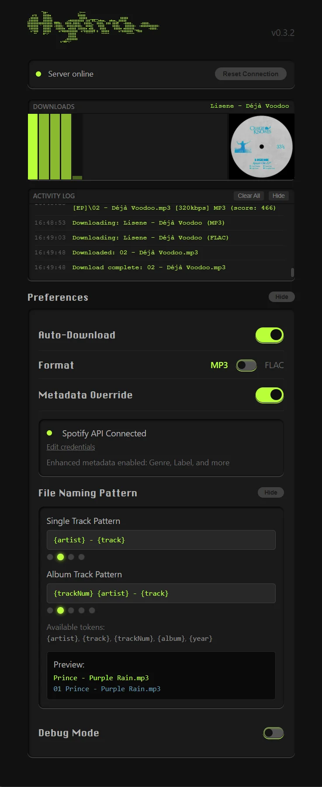

===============================================================================

         _
          $@*                   ,7***
   r*$    $$$$s                 $$$$$
 ,$$$$$   $$$$$;                 $$$$$  _____              $$$$$
,$$$$$$   $$$$$$ ___     ,r@$$$$$$$$ l$$ $$,,s@&s,  s@&s,_$$$$$
$$$$$$$$$$$$$$$l $$$$;  $$$$.$$$$;  $$$$l_  $$$$, $$$ $$$$   ~$$$$.     ~$$$$.  
$$$$$$$ ` $$$$$$ ;$$$$;  $$$$l$$$$;  $$$$;   $$$$     $$$$;   $$$$$$~  :$$$$$$$$$$$:
 l$$$$$   $$$$l   l$$$$s  s$$$$ l$$$$s s$$_   $$$$     $$$$s s$$$$$$___      ~$$$$.
  L*$$$   $$$$$     L*@$$$$$$$$$  L*$$$$$$$ $  $$$$$      L*$$$$$$$  *$$$     
    ^^    @*!'            $$$$$      `````     ^^^^^           ^^^^^     
                          $$$$$
                        ,$$$$$$$
                     L*@@*!'


===============================================================================
                             ---- v0.1.8 ----

          SPOTIFY → SOULSEEK BRIDGE  |  Multi-headed auto-download beast 


┌──────────────────────────────────────────────────────────────────────────────┐
│                            >> WHAT IS THIS? <<                               │
└──────────────────────────────────────────────────────────────────────────────┘

  Click a button in Spotify → Auto-search & download on Soulseek
  → Clean metadata & artwork applied automatically

  ╔═══════════════════════════════════════════════════════════════════════════╗
  ║  BROWSER EXTENSION  →  BRIDGE SERVER  →  NICOTINE+ PLUGIN  →  DOWNLOAD  ║
  ╚═══════════════════════════════════════════════════════════════════════════╝


┌──────────────────────────────────────────────────────────────────────────────┐
│                              >> FEATURES <<                                  │
└──────────────────────────────────────────────────────────────────────────────┘

  [√] One-click send from Spotify to Nicotine+
  [√] Smart auto-download with quality scoring
  [√] Automatic fallback - tries top 5 candidates on failure
  [√] Format preference toggle :
      • Choose between MP3 (lossy) or FLAC (lossless)
      • Smart fallback to alternative formats if preferred unavailable
      • Also supports ALAC and WAV
  [√] Professional metadata management:
      • Supports both MP3 and FLAC files
      • Renames to "Artist - Track.mp3" or "Artist - Track.flac"
      • MP3: Writes ID3v2 tags via node-id3
      • FLAC: Writes Vorbis comments via flac-tagger
      • Tags: Artist, Title, Album, Year, Track#
      • Embeds high-quality album artwork
      • Optional: Genre & Label (with Spotify API)
  [√] Extension popup with full control
  [√] Visual feedback on all actions

  ┌────────────────────────────────────────────────────────────────────────────┐
  │                                                                            │
  │                                     │
  │                                                                            │
  └────────────────────────────────────────────────────────────────────────────┘

┌──────────────────────────────────────────────────────────────────────────────┐
│                           >> INSTALLATION <<                                 │
└──────────────────────────────────────────────────────────────────────────────┘

  ╔══════════════════════════════════════════════════════════════════════════╗
  ║  WINDOWS                                                                 ║
  ╚══════════════════════════════════════════════════════════════════════════╝

  1. Download & Extract
     → Go to: github.com/bitm4ncer/Hydra_plus/releases
     → Download: Hydra+ 0.1.5 (ZIP)
     → Right-click ZIP → Extract All

  2. Run Installer
     → Open extracted folder
     → Double-click INSTALL_WINDOWS.bat
     → If Node.js missing: installer opens download page, install it, re-run

  3. Load Extension (installer shows you how)
     → Open Chrome/Edge → chrome://extensions/
     → Enable "Developer mode" (top-right toggle)
     → Click "Load unpacked"
     → Paste path from installer output → Select folder

  4. Enable Plugin (installer shows you how)
     → Open Nicotine+ → Settings → Plugins
     → Enable "Hydra+ (Browser Link)"
     → Click OK

  Done! Buttons appear on Spotify tracks.


  ╔══════════════════════════════════════════════════════════════════════════╗
  ║  macOS / LINUX                                                           ║
  ╚══════════════════════════════════════════════════════════════════════════╝

  1. Download & Extract
     → Go to: github.com/bitm4ncer/Hydra_plus/releases
     → Download: Hydra+ 0.1.5 (ZIP)
     → Double-click ZIP to extract (or use terminal: unzip Hydra_plus-0.1.5.zip)

  2. Run Installer
     → Open Terminal
     → Drag INSTALL_MAC_LINUX.sh into Terminal (auto-fills path)
     → Press Enter
     → If Node.js missing: follow installer instructions, re-run

     Alternative: cd to folder, run: chmod +x INSTALL_MAC_LINUX.sh && ./INSTALL_MAC_LINUX.sh

  3. Load Extension (installer shows you how)
     → Open Chrome/Brave → chrome://extensions/
     → Enable "Developer mode" (top-right toggle)
     → Click "Load unpacked"
     → Copy path from installer output → Select folder

  4. Enable Plugin (installer shows you how)
     → Open Nicotine+ → Settings → Plugins
     → Enable "Hydra+ (Browser Link)"
     → Click OK

  Done! Buttons appear on Spotify tracks.


  ╔══════════════════════════════════════════════════════════════════════════╗
  ║  USAGE                                                                   ║
  ╚══════════════════════════════════════════════════════════════════════════╝

  → Go to open.spotify.com
  → Click ▶ button next to any track (green = success, red = error)
  → Track auto-downloads in Nicotine+
  → Click extension icon for settings (auto-download, metadata, etc.)


┌──────────────────────────────────────────────────────────────────────────────┐
│                       >> METADATA PROCESSING <<                              │
└──────────────────────────────────────────────────────────────────────────────┘

  WITHOUT SPOTIFY API:              WITH SPOTIFY API:
  ────────────────────              ─────────────────
  [√] Artist Name                   [√] All without API features +
  [√] Track Title                   [√] Genre
  [√] Album Name                    [√] Label/Publisher
  [√] Release Year
  [√] Track Number
  [√] High-Quality Artwork

  ╔══════════════════════════════════════════════════════════════════════════╗
  ║  HOW TO GET SPOTIFY API CREDENTIALS (OPTIONAL)                          ║
  ╚══════════════════════════════════════════════════════════════════════════╝

  1. Go to: developer.spotify.com/dashboard
  2. Log in with your Spotify account
  3. Click "Create app"
     → App name: "Hydra Plus" (or anything you want)
     → App description: "Personal use for Hydra+"
     → Redirect URI: http://localhost (doesn't matter for this use)
     → Check: "Web API"
  4. Click "Settings" → Copy your Client ID and Client Secret
  5. Open Hydra+ extension popup → Paste credentials → Save

  ⚠️  SECURITY: Never share your credentials publicly or commit them to git!
      Credentials are stored locally in:
      • Chrome storage (extension popup)
      • Hydra+_Plugin/Server/spotify-credentials.json (bridge server)

  ⚠️  FIRST-TIME SETUP: Copy the template file to create your credentials:
      Copy: Hydra+_Plugin/Server/spotify-credentials.json.template
      To:   Hydra+_Plugin/Server/spotify-credentials.json
      Edit the new file and replace placeholders with your actual credentials.

  Credentials are FREE to use and only stored on your local machine.

┌──────────────────────────────────────────────────────────────────────────────┐
│                      >> AUTO-DOWNLOAD SCORING <<                             │
└──────────────────────────────────────────────────────────────────────────────┘

  BITRATE (max 100)      DURATION (max 100)      FILE SIZE (max 50)
  320kbps = 100          ±2sec  = 100            >8MB = 50
  256kbps = 80           ±5sec  = 80             >5MB = 40
  192kbps = 60           ±10sec = 50             >3MB = 30
  128kbps = 40           ±20sec = 25             >1MB = 20

  FILENAME MATCH (max 50)                        FILE TYPE (+10)
  Exact = 50, Word match = proportional          .mp3 = +10

  ═══════════════════════════════════════════════════════════════════════════

  TRIGGERS:
  • Score >100 after 15s → Download now (high confidence)
  • Score >50 after 30s  → Download best (timeout)
  • Top 5 candidates tracked for auto-fallback

  PLANNED: User-defined scoring preferences!


┌──────────────────────────────────────────────────────────────────────────────┐
│                         >> REQUIREMENTS <<                                   │
└──────────────────────────────────────────────────────────────────────────────┘

  BROWSER:    Vivaldi, Brave, Chrome, Edge (Manifest V3)
  SERVER:     Node.js v14+, npm package: node-id3
  PLUGIN:     Nicotine+ (Soulseek client), Python, Internet


┌──────────────────────────────────────────────────────────────────────────────┐
│                           >> ARCHITECTURE <<                                 │
└──────────────────────────────────────────────────────────────────────────────┘

  ┌──────────────┐
  │ SPOTIFY WEB  │  Click Send
  └──────┬───────┘
         │
         ▼ HTTP POST
  ┌──────────────┐
  │    BRIDGE    │  Queue JSON
  │   (Node.js)  │
  └──────┬───────┘
         │
         ▼ Poll /pending
  ┌──────────────┐
  │  NICOTINE+   │  do_search()
  │   PLUGIN     │
  └──────┬───────┘
         │
         ▼ Download complete
  ┌──────────────┐
  │   METADATA   │  Fix tags, rename, artwork
  │  PROCESSOR   │
  └──────┬───────┘
         │
         ▼
    Clean MP3!


┌──────────────────────────────────────────────────────────────────────────────┐
│                            >> FILE TREE <<                                   │
└──────────────────────────────────────────────────────────────────────────────┘

  Spotify_TrackCopy/          nicotine_browser_link/
  ├── icon/                   ├── Server/
  ├── assets/                 │   ├── bridge-server.js
  ├── manifest.json           │   ├── package.json
  ├── content.js              │   ├── node_modules/
  ├── popup.html              │   └── nicotine-queue.json
  ├── popup.js                ├── __init__.py
  ├── styles.css              └── PLUGININFO
  └── README.txt


┌──────────────────────────────────────────────────────────────────────────────┐
│                          >> TROUBLESHOOTING <<                               │
└──────────────────────────────────────────────────────────────────────────────┘

  Buttons not showing?        → Refresh Spotify, check chrome://extensions/
  Send button red?            → Bridge not running, check plugin enabled
  Not auto-searching?         → Enable plugin in Nicotine+ settings
  Metadata not applied?       → Enable "Metadata Override" in popup
  Spotify API won't connect?  → Verify credentials, create new app


================================================================================

              Made with <3 for the Soulseek community

================================================================================
